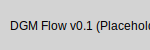

# LLM Sidecar with Hermes-3 8B GPTQ & Phi-3-mini

[](https://github.com/OWNER/REPO/actions/workflows/e2e-orchestrator.yaml)

## Project Overview

This project provides a Dockerised side-car service for running two core local Large Language Models (LLMs):

* **Hermes-Trismegistus-III-8B-GPTQ**: This serves as the main advanced reasoning and text generation model.
* **Phi-3-mini-4k-instruct (int8 ONNX)**: A highly capable and lightweight model, fine-tuned for JSON planning and structured data output. It is continuously improved via a nightly QLoRA / DPO feedback loop.

The sidecar container exposes a REST API (using FastAPI) for interacting with these models and includes a GPU VRAM watchdog to help prevent out-of-memory crashes on consumer-grade GPUs.

---

## Architecture v3

**(Placeholder for new architecture diagram - `docs/arch_v3.png` needs to be created/updated manually)**

A detailed description of the v3 architecture, including components and interaction flows, can be found here:
[Link to diagram description](docs/arch_v3_description.txt) (Note: This file also needs to be updated for v3)

---

## Prerequisites

| Requirement                 | Purpose                                                                     |
| --------------------------- | --------------------------------------------------------------------------- |
| **Docker + Docker Compose** | Container orchestration                                                     |
| **NVIDIA driver w/ CUDA**   | GPU inference inside the container                                          |
| **≈ 10 GB free VRAM**       | 6-7 GB for Hermes-3 GPTQ, ≈ 2 GB for Phi-3 int8, plus head-room for tensors |

---

## Quick-start (Hermes-3 side-car)

```bash
# 1. clone & cd
git clone https://github.com/your/fork.git # Replace with your fork/repo URL
cd your-repo-name # Replace with your directory name

# 2. copy env file and tweak if you like
cp .env.template .env      # default Hermes ctx = 6144

# 3. spin it up
make rebuild
```
This will build the images (if necessary, without cache) and start the services defined in `docker-compose.yaml` (typically `llm-sidecar` and `redis`) in detached mode.
To view logs for a service (e.g., `llm-sidecar`), use `make logs SVC=llm-sidecar` or simply `make logs` (which defaults to `llm-sidecar`).
To enter a Poetry-managed shell with your `.env` variables loaded, run `make dev-shell`.

*Note: The `redis` service is included for features relying on it, like the event bus or TTS streaming.*

FastAPI is now live on **[http://localhost:8000](http://localhost:8000)**.

---

## Quick-start (Full Simulator & Orchestrator Loop)

This mode runs the market data simulator, the policy orchestrator, the LLM sidecar, and Redis. The orchestrator listens to ticks from the simulator and triggers proposal workflows.

**Prerequisites:**
* Ensure you have a market data CSV file (e.g., `data/spy_1h.csv`). You might need to create this directory and file.
* A `docker-compose.yaml` (or a dedicated one like `docker-compose.full.yaml`) that defines services for `sim`, `orchestrator`, `llm-sidecar`, and `redis`.

**Example `docker-compose.full.yaml` (illustrative - adapt as needed):**
```yaml
version: '3.8'
services:
  redis:
    image: redis:alpine
    ports:
      - "6379:6379"
    # command: redis-server --save "" --appendonly no # Optional: disable persistence for dev

  llm-sidecar:
    build:
      context: .
      dockerfile: Dockerfile # Assuming your main Dockerfile for llm-sidecar
    env_file: .env
    ports:
      - "8000:8000"
    volumes:
      - ./models:/models # If downloading models outside image
      - ./phi3_feedback_log.jsonl:/app/phi3_feedback_log.jsonl
      - ./phi3_feedback_data.jsonl:/app/phi3_feedback_data.jsonl
    deploy: # Requires Docker Swarm mode or `docker compose --compatibility`
      resources:
        reservations:
          devices:
            - driver: nvidia
              count: 1
              capabilities: [gpu]
    depends_on:
      - redis

  sim:
    build:
      context: .
      dockerfile: Dockerfile.sim # Create a separate Dockerfile for the simulator
    # Example Dockerfile.sim:
    # FROM python:3.9-slim
    # WORKDIR /app
    # COPY requirements.txt .
    # RUN pip install -r requirements.txt
    # COPY sim /app/sim
    # COPY llm_sidecar /app/llm_sidecar # For EventBus dependency
    # ENTRYPOINT ["python", "-m", "sim.engine"]
    volumes:
      - ./data:/app/data # Mount your CSV data directory
    command: >
      python -m sim.engine 
      /app/data/spy_1h.csv 
      --redis_url redis://redis:6379/0 
      --speed 10x 
      --from_date 2023-10-01
    depends_on:
      - redis
    # network_mode: host # Or ensure they are on the same docker network

  orchestrator:
    build:
      context: .
      dockerfile: Dockerfile.orchestrator # Create a separate Dockerfile for the orchestrator
    # Example Dockerfile.orchestrator:
    # FROM python:3.9-slim
    # WORKDIR /app
    # COPY requirements.txt .
    # RUN pip install -r requirements.txt
    # COPY osiris_policy /app/osiris_policy
    # COPY llm_sidecar /app/llm_sidecar # For EventBus and DB dependencies
    # ENTRYPOINT ["python", "-m", "osiris_policy.orchestrator"]
    env_file: .env # If it needs any env vars like API keys (not currently the case)
    command: >
      python -m osiris_policy.orchestrator 
      --redis_url redis://redis:6379/0 
      --market_channel market.ticks 
      --ticks_per_proposal 5
    depends_on:
      - redis
      - llm-sidecar # Orchestrator calls the sidecar's API
    # network_mode: host

  # vram-watchdog: (if used with the full loop)
  #   build:
  #     context: .
  #     dockerfile: Dockerfile.watchdog
  #   depends_on:
  #     - llm-sidecar
  #   environment:
  #     - CONTAINER_NAME_TO_RESTART=llm-sidecar 
  #   volumes:
  #     - /var/run/docker.sock:/var/run/docker.sock
  #   privileged: true # Required for Docker socket access
```

**To run (assuming you have the compose file, e.g., `docker-compose.full.yaml`):**
```bash
# 1. Ensure Dockerfiles for sim and orchestrator exist if not using a single large image.
# 2. Prepare your data/spy_1h.csv (or other data file).
# 3. docker compose -f docker-compose.full.yaml up -d sim orchestrator llm-sidecar redis
# (Remove -d to see logs, or use `docker compose -f ... logs -f <service_name>`)
```
This setup will start the simulator feeding data into Redis, and the orchestrator processing these ticks to generate and evaluate trade proposals using the LLM sidecar.

---

## VRAM Watchdog

`vram_watchdog.sh` runs in a second container (`vram-watchdog`) and:

* polls `nvidia-smi` every 60 s;
* if usage > **10.5 GB** for 3 consecutive reads it restarts `llm-sidecar`.

---

## API Endpoints

*All endpoints live in `server.py`.*

### **POST `/generate/`** (Unified)

Generate with **either** Hermes or Phi-3.

| Field        | Type   | Default    | Notes                  |
| ------------ | ------ | ---------- | ---------------------- |
| `prompt`     | string | –          | Required               |
| `max_length` | int    | 256        | Optional               |
| `model_id`   | string | `"hermes"` | `"hermes"` or `"phi3"` |

*If `model_id` is omitted Hermes is used.*
*Phi-3 responses respect a strict JSON schema and, once the nightly QLoRA/DPO pipeline is running, will embed the latest fine-tuned weights.*

#### Response (Hermes success)

```json
{
  "generated_text": "The model's response..."
}
```

#### Response (Phi-3 success — example)

```json
{
  "ticker": "XYZ",
  "action": "adjust",
  "side": "LONG",
  "new_stop_pct": 5.0,
  "new_target_pct": 10.0,
  "confidence": 0.85,
  "rationale": "Price action suggests upward trend."
}
```

---

### **Model-specific shortcuts**

* **POST `/generate/hermes/`** – vanilla Hermes text.
* **POST `/generate/phi3/`** – structured JSON via Phi-3 (same schema).

---

### **POST `/propose_trade_adjustments/`**

1. Phi-3 writes a JSON trade proposal.
2. Hermes critiques it in plain English.
3. Both objects are logged for the nightly feedback loop.

---

### **POST `/feedback/phi3/`**

Submit corrections or ratings for a previous Phi-3 proposal.

```json
{
  "transaction_id": "uuid-from-log",
  "feedback_type": "correction",
  "feedback_content": { "comment": "Stop too tight." },
  "corrected_proposal": { /* full corrected JSON … */ }
}
```

---

### **GET `/health`**

Returns:

```json
{
  "status": "ok",                // "partial_error" or "error"
  "hermes_loaded": true,
  "phi3_loaded": true,
  "phi3_model_file_exists": true,
  "device": "cuda"
}
```

---

## Voice Output (Text-to-Speech)

The system utilizes the **Chatterbox plug-in** for Text-to-Speech (TTS) capabilities, allowing generation of voice output for events such as Hermes model assessments.

**Note on Requirements:** TTS, especially with models like Chatterbox, can be resource-intensive. While Chatterbox is designed to be efficient, ensure your system has adequate CPU resources. Some advanced TTS features or future enhancements might benefit from or require GPU acceleration (potentially involving Vulkan or similar graphics APIs).

### 1. Direct API Call (`/speak`)

You can directly request TTS synthesis for any text via the `/speak` endpoint:

```bash
curl -X POST \
  -H "Content-Type: application/json" \
  -d '{"text": "Hello world, this is a test.", "exaggeration": 0.5}' \
  http://localhost:8000/speak \
  --output speech_output.wav
```
This saves the WAV audio data to `speech_output.wav`.
Optional fields in the JSON payload:
- `exaggeration` (float, default 0.5): Controls expressiveness.
- `ref_wav_b64` (string, optional): Base64 encoded WAV for voice cloning.

### 2. Redis Channel (`audio.bytes`)

Internally triggered TTS (e.g., by the orchestrator) publishes raw WAV audio data (base64 encoded) to the Redis channel `audio.bytes`. Subscribe with any Redis client to process this data.

### 3. Web Audio Console

Listen to audio streamed from the `audio.bytes` Redis channel in real-time using the web audio console:

*   **URL**: `static/audio_console.html`
    *   Access locally at [http://localhost:8000/static/audio_console.html](http://localhost:8000/static/audio_console.html) (requires `StaticFiles` mount in `server.py`).
    *   Alternatively, open `static/audio_console.html` directly from your file system.

The console uses Server-Sent Events (SSE) via the `/stream/audio` endpoint, which streams audio from the Redis channel.

---

## Phi-3 Feedback Loop (Nightly)

1. **Logging** – every `/propose_trade_adjustments/` call appends to `/app/phi3_feedback_log.jsonl`.
2. **User feedback** – collected via `/feedback/phi3/`, stored in `/app/phi3_feedback_data.jsonl`.
3. **QLoRA / DPO fine-tune** – a nightly job trains on the feedback set and produces a new int8 ONNX; the next morning `llm-sidecar` hot-loads it.
4. **Prompt-augmentation** – latest high-quality corrections are few-shot-prepended to Phi-3 prompts during the day.

---

## CI / CD

- **`.github/workflows/ci.yaml`**: Builds the main image, boots the container, and hits `/health` on every push & PR to `main`.
- **`.github/workflows/ci-audio-smoke.yaml`**: Performs a smoke test on the TTS audio generation by calling `/speak` and verifying the WAV output.
- **`.github/workflows/e2e-orchestrator.yaml`**: (Assumed from badge) Runs an end-to-end test of the orchestrator loop.
- **Lint job**: Quick check that runs `actionlint` and `yamllint` on every pull request before Docker builds.


Patience Profits!

---

## Troubleshooting

Here are some common issues and potential solutions:

### Problem: `numpy` version conflicts (e.g., `numpy < 2.0` errors).
*   **Solution**: Some dependencies (especially older ones or those with strict pinning) might require an older major version of numpy (e.g., < 2.0). If you encounter errors like `TypeError: '<' not supported between instances of 'Version' and 'Version'` related to numpy, or direct version conflicts, try pinning numpy to a specific compatible version in your `requirements.txt` or virtual environment. For example:
    ```
    numpy==1.26.4
    ```
    You may need to experiment to find a version compatible with all your packages or investigate which package has the strict requirement.

### Problem: ONNX Runtime or model loading errors (e.g., "onnxruntime.capi.onnxruntime_pybind11_state.Fail: ...model... not found").
*   **Solution**: This often indicates that the ONNX model files (e.g., for Phi-3) are not where the application expects them.
    *   **Check Paths**: Verify that the model paths configured in your application (e.g., environment variables, code constants) correctly point to the model files.
    *   **Model Download**: Ensure the models are actually downloaded. You can use `huggingface-cli download your-model-name --local-dir /path/to/models` to fetch them.
    *   **Docker Mounts**: If running in Docker and models are external, ensure your `docker-compose.yaml` or `docker run` command correctly mounts the host directory containing the models to the expected path inside the container (e.g., `/models` or `/app/models`).
    *   **Permissions**: Ensure the application has read permissions for the model files and directories.

### Problem: LanceDB path issues or errors like "Table not found" after a reset/restart.
*   **Solution**:
    *   **Default Path**: LanceDB, in this project, stores its data in `/app/lancedb_data` inside the container by default.
    *   **Persistence**: If you need LanceDB data (feedback logs, run history, etc.) to persist across container restarts, you must mount this directory as a Docker volume:
        ```yaml
        # In your docker-compose.yaml for the llm-sidecar service:
        volumes:
          - lancedb_data_volume:/app/lancedb_data
        # ...
        volumes:
          lancedb_data_volume: {} # Defines a named volume
        ```
        Without a volume, data written to `/app/lancedb_data` will be lost when the container stops.
    *   **Automatic Table Creation**: The system is designed to check for tables on startup (`init_db()` in `llm_sidecar/db.py`) and create them if they are missing. So, a "Table not found" error might appear on a fresh start if data is not persisted, but tables should be created automatically. If errors persist, it might indicate issues with write permissions to the LanceDB data directory or deeper configuration problems.

---

## DGM Kernel (`dgm_kernel`)

The Darwin Gödel Machine (DGM) Kernel is a component responsible for automated self-improvement of the system's policies or strategies. It operates in a meta-loop:
1.  Fetches recent performance traces.
2.  Proposes a code patch to potentially improve performance (currently uses a dummy patch).
3.  Verifies the patch using a combination of a `proofable_reward` function and a Pylint score (currently uses stubs for both).
4.  If verified, applies the patch and reloads the affected module.
5.  Monitors rewards and can roll back patches if performance degrades.

### DGM Flow Diagram



### Running DGM Kernel

The DGM Kernel meta-loop can be run as a standalone process:

```bash
python -m dgm_kernel.meta_loop
```

To run the loop for a single iteration (e.g., for testing):

```bash
python -m dgm_kernel.meta_loop --once
```

### Environment Variables (DGM Kernel)

*   `REDIS_HOST`: Hostname for the Redis instance (defaults to 'redis' in code).
*   `REDIS_PORT`: Port for the Redis instance (defaults to 6379 in code).
*(Note: Currently, no other specific environment variables are required beyond what Redis client might pick up by default, as Redis connection is hardcoded in `meta_loop.py`.)*

---

## AZR Planner Service (`services/azr_planner`)

The AZR (Automated Zero-shot Reward) Planner Service is a stub microservice intended to provide planning capabilities. Currently, it exposes a single endpoint that returns a "No Operation" (NOP) patch.

### Running AZR Planner Service

**Using Docker Compose:**

The service is defined in `docker/compose.yaml` and can be started with:

```bash
docker compose -f docker/compose.yaml up azr_planner
```
It will be available on port 8001 by default.

**Using Helm (Kubernetes):**

The AZR Planner service can be enabled in the Osiris Helm chart by setting `azrPlanner.enabled` to `true` in your `values.yaml` file or via `--set azrPlanner.enabled=true` during `helm install/upgrade`.

```yaml
# Example values.yaml snippet
azrPlanner:
  enabled: true
  # ... other configuration ...
```

### Canary Deployment

Use `helm/osiris/values-canary.yaml` to deploy a canary release. This file
configures a single replica with 10% of incoming traffic routed to the canary
namespace and enables full OpenTelemetry tracing.

```bash
helm upgrade --install osiris-canary helm/osiris \
  -f helm/osiris/values-canary.yaml \
  --namespace osiris-canary --create-namespace
```

### Environment Variables (AZR Planner)

*   *(No specific environment variables are currently defined or used by the stub service beyond standard Uvicorn/FastAPI configurations.)*
