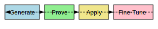

# Quality Loop Overview

Osiris maintains a tight **Generate → Prove → Apply → Fine‑Tune** cycle to incrementally
improve trade generation and automated code updates. New ideas or patches are drafted,
verified, applied if they improve reward, and then incorporated into a nightly
fine‑tuning routine. This page collects the notes for that process.



### Reward Signals

The system evaluates new patches using several reward components:

| Signal | Purpose |
| --- | --- |
| **Profit** | Raw profit and loss from closed trades |
| **Risk‑Adjusted Return** | Profit normalized by drawdown or other risk metrics |
| **Novelty** | Encourages diverse ideas rather than repetitive trades |
| **Latency** | Rewards faster execution and lower decision lag |

The final reward combines these signals to determine whether a patch or strategy
should be kept.

Each component addresses a different dimension of quality:

* **Profit** tracks raw gains or losses on executed trades.
* **Risk‑Adjusted Return** penalizes high drawdowns so that risky strategies do not dominate.
* **Novelty** provides incentive for the model to explore new approaches instead of repeating the same pattern.
* **Latency** measures how quickly an idea can be acted on once generated.

Balancing these metrics lets operators tune the loop toward either conservative or experimental behavior.

> **Rollback Logic**
> 
> When a patch results in a negative reward it is immediately rolled back. The
> details of this mechanism live in
> [`dgm_kernel/meta_loop.py`](../dgm_kernel/meta_loop.py).

The fine‑tuning stage is automated by the nightly script
[`scripts/nightly_qlora.sh`](../scripts/nightly_qlora.sh), which harvests feedback
and retrains adapters using QLoRA.

# Hermes Scoring Rationale

This section explains the rationale behind the Hermes scoring system.

The Hermes scoring system is designed to evaluate trade ideas based on their risk-reward profile. The evaluation is performed by a large language model (LLM) using a specific prompt template.

## Prompt Template

The LLM is prompted with the following template to score a trade idea:

```
Rate the above trade idea from 0-to-10 where 10 = excellent risk-reward … Reply with just the number.
```

## Score Normalization

The raw score obtained from the LLM is an integer between 0 and 10 (inclusive). This score is then normalized to a 0-1 scale for consistent interpretation and use in downstream processes.

The conversion formula is:

`normalized_score = raw_score / 10.0`

For example, if the LLM returns a score of 7, the normalized score will be 0.7.

## Key Considerations

While the primary metric is risk-reward, the evaluation implicitly considers factors such as:

*   **Clarity of the Idea:** How well-defined and understandable is the trade proposal?
*   **Market Context:** Does the idea align with current market conditions or analyses?
*   **Potential Downside:** Are risks adequately acknowledged or mitigated?
*   **Plausibility of Upside:** Is the potential reward realistic?

This system aims to provide a standardized and objective measure of trade idea quality.

## Outcome Logger Logic

This section describes the logic behind the outcome logger. The outcome logger is responsible for tracking the actual performance of trade ideas after they have been proposed and scored.

The core of the outcome logging process is a new cron worker, `workers/outcome_logger.py`, which executes its logic hourly. The process is as follows:

1.  **Scan for Eligible Advice:** The worker scans for "accepted" trade advice records that are at least 24 hours old and do not yet have an outcome recorded. This ensures that trades have had some time to mature before attempting to determine their outcome.

2.  **Price Retrieval:** For each eligible trade advice, the system queries for the relevant price data. This is typically the closing price. The primary source for this data is Yahoo Finance (using the `yfinance` library). As a fallback, or for assets not covered by Yahoo Finance, a local OHLC (Open, High, Low, Close) price store is consulted.

3.  **Outcome Determination:** Based on the retrieved price data, the system determines the outcome of the trade:
    *   **Win:** The price has hit the predefined target price.
    *   **Loss:** The price has hit the predefined stop-loss price.
    *   **Breakeven:** The trade has been closed out at or very near the entry price, resulting in neither significant profit nor loss (specific breakeven conditions might be defined).
    *   **Open:** If none of the above conditions are met, the trade is still considered open and will be evaluated in subsequent runs.

4.  **Data Update and Notification:** Once an outcome (Win, Loss, or Breakeven) is determined:
    *   The corresponding record in the LanceDB vector database is updated with the outcome status, closing price, and date.
    *   A Redis event `advice.outcome` is published. This event contains details of the trade and its outcome, allowing other services or monitoring systems to react accordingly.

This logging process is crucial for:
*   Validating the effectiveness of the Hermes scoring system.
*   Providing a feedback loop for refining trade generation strategies.
*   Maintaining an auditable record of trade performance.

## Nightly RL-DPO Pipeline and Adapter Preference

This section outlines the nightly Reinforcement Learning from Direct Preference Optimization (RL-DPO) pipeline and the system for managing adapter preference. This pipeline is designed to continuously fine-tune the underlying language models based on observed performance and preferences from real trade outcomes.

The process is orchestrated by an extended version of the `scripts/nightly_qlora.sh` script. Here's a breakdown of the pipeline:

1.  **Dataset Construction:**
    *   The script first constructs a ranking dataset in JSONL format. Each line in this dataset represents a preference pair: `{prompt, good_reply, bad_reply}`.
    *   The `prompt` is the original input that led to the trade advice.
    *   A `good_reply` is defined as the Phi-3 generated JSON output corresponding to a trade idea that resulted in a "winning" outcome (target hit), as determined by the Outcome Logger.
    *   A `bad_reply` is defined as the Phi-3 generated JSON output corresponding to a trade idea that resulted in a "losing" outcome (stop hit).
    *   This dataset is built by querying the LanceDB records updated by the Outcome Logger.

2.  **DPO Training:**
    *   Once the dataset is prepared, the script executes a new TRL (Transformer Reinforcement Learning) script, `run_dpo.py`.
    *   This DPO training is run against the latest available LoRA adapter (typically the one produced by the previous night's QLoRA fine-tuning or a previous DPO run). This allows the model to learn from preference pairs derived from its own recent generations and their real-world outcomes.

3.  **Adapter Output:**
    *   Upon successful completion of the DPO training, a new LoRA adapter directory is created.
    *   The naming convention for these DPO-tuned adapters is `adapters/YYYYMMDD-dpo`, where `YYYYMMDD` represents the date of the training run.

4.  **Adapter Preference Logic:**
    *   The model loading mechanism within the application is updated to implement an adapter preference system.
    *   When loading adapters, if two adapters exist for the same date (e.g., a base QLoRA-tuned adapter `adapters/YYYYMMDD` and a DPO-tuned adapter `adapters/YYYYMMDD-dpo`), the system will prefer the `-dpo` version.
    *   This ensures that the model benefiting from direct outcome-based preference tuning is prioritized for generating new advice.

The goal of this nightly RL-DPO pipeline is to create a tight feedback loop where the model continuously learns to generate trade advice that is more likely to lead to positive outcomes, refining its understanding of desirable versus undesirable outputs based on empirical results.

## Approving or Rejecting Trade Advice in the UI

This section describes how users interact with trade advice within the user interface (UI), specifically in the "Advisory" tab. This interaction is a crucial part of the quality loop, providing direct human oversight, feedback, and the ability to refine model-generated advice.

### UI Interaction Workflow:

1.  **Advice Display:** Trade advice generated by the system is presented in a tabular format within the "Advisory" tab. Each row represents a distinct piece of advice and includes relevant details (e.g., ticker, entry price, target, stop, rationale, Hermes score).

2.  **Action Buttons:** For each row of advice, the UI provides three action buttons:
    *   **✅ Approve:** Users click this button to indicate their agreement with and acceptance of the trade advice.
    *   **❌ Reject:** Users click this button to indicate their disagreement with or disapproval of the trade advice.
    *   **✏️ Edit:** Users click this button if they wish to modify the parameters of the trade advice (e.g., adjust entry, target, or stop prices). *The specifics of the edit functionality and its feedback mechanism may be detailed in a separate document or section.*

3.  **Feedback Submission:**
    *   When a user clicks "Approve" or "Reject" (and potentially after an "Edit" action that confirms a modified advice), the UI submits this feedback to the backend.
    *   This is done via a POST request to the `/feedback/phi3/` API endpoint.
    *   The payload of this request includes `feedback_type="human_edit"` (this may need refinement to distinguish between pure approval/rejection and actual edits) and any adjustments to the confidence score or other parameters made by the user. For simple approve/reject actions, the original confidence might be passed along or a default high/low confidence indicated.

4.  **Live Table Update:**
    *   Upon successful submission of the feedback, the "Advisory" tab's live table is updated to reflect the new status of the advice.
    *   A dedicated "status" column for each advice row will change to "approved" or "rejected" (or "edited") based on the user's action. This provides immediate visual confirmation of the recorded feedback.

This UI-driven feedback mechanism ensures that human expertise can directly influence the system's understanding of advice quality and allows for the collection of preference data (approved vs. rejected, or original vs. edited) that can be used in subsequent training iterations, such as the RL-DPO pipeline.

## Example Workflow

The following outline shows how the pieces fit together over the course of a trading day:

1.  **Generation:** The system or a human drafts new advice or a code patch and submits it to the queue.
2.  **Proving:** Automated checks validate the patch using unit tests, style rules and the Hermes score.
3.  **Application:** If the patch improves the reward, it is applied live and begins affecting trading decisions.
4.  **Observation:** Every trade result is logged along with metadata about the patch that produced it.
5.  **Fine‑Tuning:** The nightly job aggregates the last 24 hours of feedback and runs `scripts/nightly_qlora.sh` to train adapters.
6.  **Reloading:** The updated adapters are loaded on startup or during the next generation step, completing the loop.

Developers can adjust the weights of each reward signal in the configuration. A heavier emphasis on profit may speed convergence toward short‑term gains, while higher novelty weight encourages exploration. Tuning these parameters is an active area of experimentation.

### Suggested Future Enhancements

*   Add a visualization dashboard showing reward trends over time.
*   Expand the prover to include custom static analysis or formal checks.
*   Investigate reinforcement learning algorithms beyond DPO for adapter updates.
*   Store rollback statistics to better understand how often negative reward occurs.
*   Alert when latency grows beyond a configurable threshold.

The quality loop thrives on small, rapid iterations. By steadily applying the cycle the system learns to prefer higher quality trades while rejecting regressions.

## Troubleshooting

Occasionally a patch may appear valid yet still degrade overall performance. When that happens check the following:

1.  Verify that the collected reward signals cover a long enough window of trades.
2.  Inspect the `dgm:rolled_back_traces` list in Redis for context on the rollback.
3.  Confirm that unit tests in the prover captured the intended behavior.
4.  Make sure the nightly adapter directory contains the latest files produced by `nightly_qlora.sh`.
5.  Review recent logs for exceptions in `dgm_kernel.meta_loop` which may indicate a failed reload.

### Running the Nightly Script Manually

The quality loop normally invokes QLoRA training from a scheduled job. To run it on demand execute:

```bash
bash scripts/nightly_qlora.sh
```

The script creates a date‑stamped adapter folder under `models/phi3/adapters/` and moves the trained files there. Reloading the sidecar will then pick up the new adapters automatically.

Keeping a record of each adapter directory allows experiments to be reproduced or rolled back if necessary.

Consistent tracking and automation make the quality loop a central part of Osiris.
